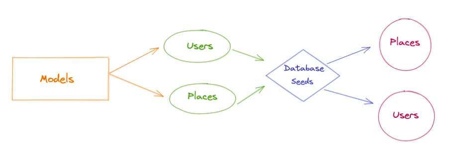
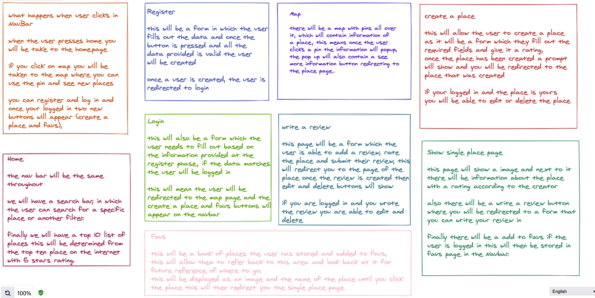
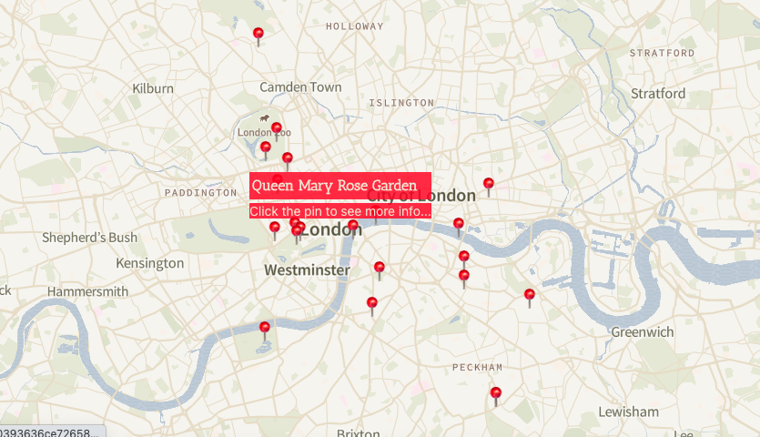
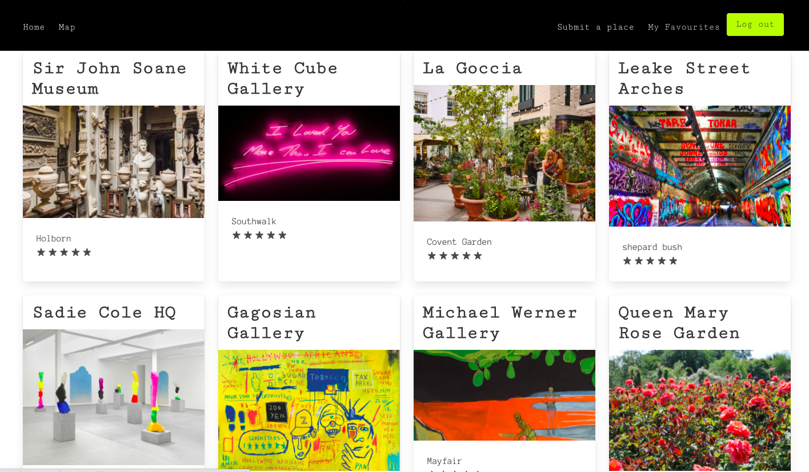
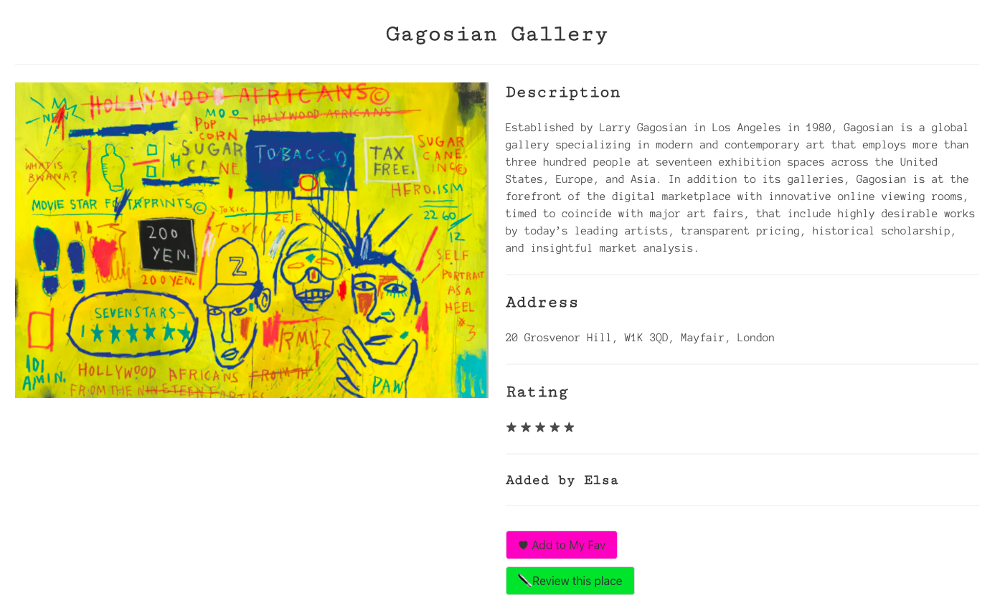
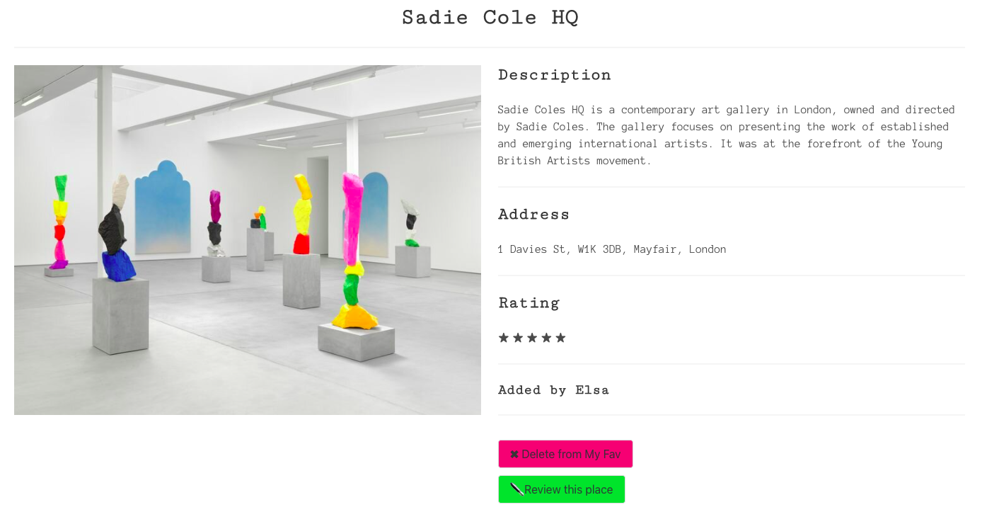
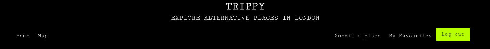
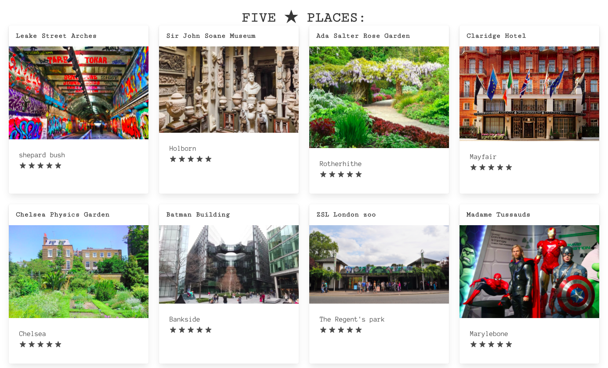

# Trippy - The app for alternative places in London

### Deployment

I deployed this website using Heroku for the backend and Netlify for the frontend and it's available [here](https://trippy-ornellaspada.netlify.app). Free servers on Heruku and Netlify sleep when they are not in use, please allow a minute or two for them to wake up.

### Concept

Trippy is a site where users can browse on a map, review and add alternative places in London that are not the city landmarks.

The users can also create a My Favourite list where they can add or delete their preferred hotspot in the city. 

### Project Brief

- One week to plan, build, and test our most advanced project to date with achievable scope and a focus on creating a professional finished product.

- Make it a full-stack MERN application by developing our own backend and frontend.

- Use an Express API to serve our data from a Mongo database.

- Consume our API with a separate frontend built with React.

- Be a complete product with multiple relationships and CRUD functionality for multiple models.

- Implement thoughtful user experiences/wireframes for MVP and additional features.

- Have a visually impressive design.


### Technologies Used ##

- *Backend:*
  - MongoDB
  - Node.js
  - Express
- *Frontend:*
  - JavaScript (ES6)
  - React.js
  - HTML5
  - CSS3 + SASS

- *Dependencies:*
  - Axios
  - react-router-dom
  - react-select
  - react-hero-carousel
  - react-spinners
  - JSONWebToken
  - bcrypt
  - mongoose-unique-validator
  - Development Tools:
  - VS Code
  - Git + GitHub
  - Mapbox
  - Heroku
  *Development Tools:*
  - VS Code
  - Git + GitHub
  - Mapbox
  - Heroku
### User Places and Wireframes

 **Backend Wireframe**


**Frontend Wireframe**


### General Approach & Planning

 - The three of us worked together to plan out our Minimum Viable Poduct using Trello.
 - We divided up the tasks needed to set up the backend and took turns writing seed data to populate the site.
 - We used Trello, Slack, Zoom, and GitHub to communicate who was responsible for what and when things had been completed. Good communication was essential for this project so we would not overwrite any changes from another group member and could handle git branch conflicts easily when they arose.
 - We finished our backend in the first two days of the project and then moved on to assigning React components for each of us to do.
 - We helped each other to resolve any errors or bugs at the start of each day after our daily standup on Zoom.
- We made all major decisions about site styling, colours, and Google Fonts together.
- We worked together across the site to add error handling and error messages for the UI.

 **Controllers for RESTful roots**

```
async function index(req, res, next) {
  try {
    const placesList = await PlaceModel.find().populate('user')
    console.log(placesList)
    // ? res obj allows us to send back data like so 
    res.status(200).json(placesList)
  } catch (error) {
    next(error)
  }
}

async function search(req, res, next) {
  try {
    console.log('working')
    const searchParams = req.query
    console.log(searchParams)

    // ? To match exact values. (can add more logic here to match substrings)
    const placesList = await PlaceModel.find(searchParams).populate('user')

    res.status(200).json(placesList)
  } catch (e) {
    next(e)
  }
}

async function show(req, res, next) {
  try {
    const placeId = req.params.placeId
    console.log('this is it', placeId)
    const place = await PlaceModel.findById(placeId).populate('user')
    console.log(place)
    
    if (!place) {
      throw new NotFound('No place found.')
    }

    res.status(200).json(place)
  } catch (e) {
    next(e)
  }
}

async function create(req, res, next){
  req.body.user = req.currentUser
  try {
    const newPlace = await PlaceModel.create(req.body)
    res.status(201).json(newPlace)
  } catch (e){
    next(e)
  }
}

async function remove(req, res, next) {
  try {
    // ? get user id
    const currentUserId = req.currentUser._id
    // ? get team data we might remove
    console.log(currentUserId)
    const place = await PlaceModel.findById(req.params.placeId)
    console.log(place)
    // ? you cant delete a place that doesn't exist
    if (!currentUserId) {
      throw new NotFound('no place found')
    } 
```


- I focussed on the rendering of the map using Mapbox.



- I developed the map view page, which shows the exact latitude and longitude of each places and the popups on each venue on the map displaying the extra info on hotspot.
```
function Map() {

  const [viewport, setViewport] = useState({
    width: '100vw',
    height: '100vh',
    latitude: 51.50853,
    longitude: -0.12574,
    zoom: 12,
    bearing: 0,
    pitch: 0,
  })

  const [places, setPlaces] = React.useState([])
  const [inHover, setHover] = React.useState('')

  React.useEffect(() => {
    const getData = async () => {
      const res = await getAllPlaces()
      setPlaces(res.data)
      console.log(res.data)
    }
    getData()
  }, [])

  const handleMouseEnter = (e) => setHover(e.target.value)

  const handleMouseLeave = () => setHover('')
```
- I worked on the My Favourite Page where the user can short list her preferences:



- And add the buttons on the places' Show Page :




**The Add and Remove Logic in JavaScript**
```
React.useEffect(() => {
    const getData = async () => {
      try {
        if (isLoggedIn){

          const res = await checkFav(placeId)
          console.log(res.data.isFav)
          setIsFav(res.data.isFav)
          setIsError(false)
        }
      } catch (err) {
        setIsError(true)
        //return <p>error</p>
      }
    }
    getData()
  }, [placeId, isLoggedIn])

  const handleDelete = async () => {
    await deletePlace(place._id)
    history.push('/places/map')
  }

  const handleAddFav = async () => {
    await addFav(place._id)
    setIsFav(true)
  }

  const handleRemFav = async () => {
    await removeFav(place._id)
    setIsFav(false)
  }
  ```
 - I also worked on the nav bar, with responsive-sizing and re-load on login, logout and register:

 
 <br>
 <br />

 - I styled the app by using Bulma and curated the minimalistic and pristine aesthetics which is inspired by art galleries websites and added an edge with fluo color buttons.
 - Created and designed the footer.
 - I worked on the review features.
 - I styled the map and and embedded it in the digital real estate.

 ## Wins ##

 - The stylish star-rating bar on the homepage and on the places' cards:

 

 - Logic behind getting the places with five stars form api.js:

  ```
    React.useEffect(() => {
    const getData = async () => {
      try {
        const res = await getPlacesWithFiveStars()
        setBestPlaces(res.data)
        
      } catch (err) {
        {<p>Something went wrong!</p>}
        console.log(err)
      } finally {
        setLoading(false)
      }
    }
    getData()
  }, [])

  ``` 
 - The profile photo upload in the review form.
 - The login and registration forms.
 - When the user adds a new venue and event at that venue, it will display on the map view as well.

  ## Challenges Overcome ##
- Handling user authentication to ensure that only the creator of an place or review would be allowed to edit or delete it.
```
import jwt from 'jsonwebtoken'

import UserModel from '../models/userModel.js'
import { secret } from '../config/environment.js'

export default function secureRoute(req, res, next) {

  // ? Check the token
  const rawToken = req.headers.authorization

  console.log(rawToken)

  if (!rawToken || !rawToken.startsWith('Bearer')) {
    return res.status(401).json({ message: 'Unauthorized1 ' })
  }

  const token = rawToken.replace('Bearer ', '')
  console.log(token)

  // ? Verify the token
  jwt.verify(token, secret, async (err, payload) => {

    if (err) {
      return res.status(401).json({ message: 'Unauthorized2 ' })
    }

    // ? Get the user using our payload.userId stick the user on the request
    const user = await  UserModel.findById(payload.sub)

    if (!user) {
      return res.status(401).json({ message: 'Unauthorized3 ' })
    }

    req.currentUser = user

    next()
  })
}
```

  ## Key Learnings ##

- Learnt to use group Git and handle merge conflicts.
- Learnt to use react-select to filter by postcode, street name, address, area.
- Cohesive and professional styling across the whole site is essential when creating a finished product.
- Collaboration - this was the dream team and we got so much more done together than I could have done myself in a week.

 ## Unsolved problems ##

- The default values do not clear from the filter selectors on the Index pages.
- Review form does not display error message for missing or incorrect info .
- Use external API in the form to search area by using postcode.

 ## Features to add ##
- Users can edit their reviews.
- Limit the top-rated events to only display top three.
- Nav bar hamburger menu for a mobile phone screen.
- Auto-calculate and input the latitude and longitude when user creates a new venue.

## Credits ##
All fonts provided by [Google Fonts](https://fonts.google.com/).


    

    


